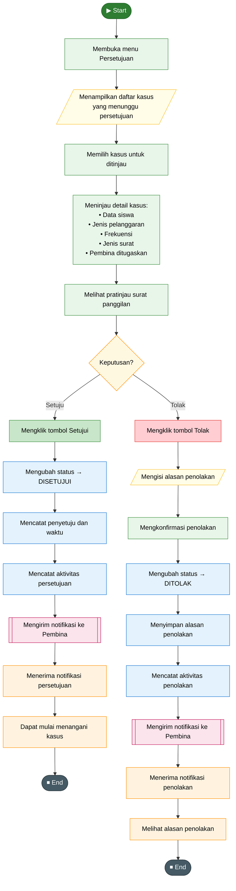

# Flowchart: Approval Tindak Lanjut

> **Referensi**: AD_10_approval_tindak_lanjut.puml  
> **Aktor**: Kepala Sekolah, Waka Kesiswaan (Approver), Pembina

```mermaid
flowchart TD
    %% === TERMINATOR (Oval) ===
    START(["▶ Start"])
    END1(["⏹ End"])
    END2(["⏹ End"])

    %% === PROCESS - Kepala Sekolah (Rectangle) ===
    A["Membuka menu Persetujuan"]
    C["Memilih kasus untuk ditinjau"]
    D["Meninjau detail kasus:<br>• Data siswa<br>• Jenis pelanggaran<br>• Frekuensi<br>• Jenis surat<br>• Pembina ditugaskan"]
    E["Melihat pratinjau surat panggilan"]
    G["Mengklik tombol Setujui"]
    H["Mengklik tombol Tolak"]
    N["Mengkonfirmasi penolakan"]

    %% === INPUT/OUTPUT (Parallelogram) ===
    B[/"Menampilkan daftar kasus<br>yang menunggu persetujuan"/]
    I[/"Mengisi alasan penolakan"/]

    %% === DECISION (Diamond) ===
    F{"Keputusan?"}

    %% === PROCESS - Sistem (Rectangle) ===
    J["Mengubah status → DISETUJUI"]
    K["Mencatat penyetuju dan waktu"]
    L["Mencatat aktivitas persetujuan"]
    O["Mengubah status → DITOLAK"]
    P["Menyimpan alasan penolakan"]
    Q["Mencatat aktivitas penolakan"]

    %% === PREDEFINED PROCESS - Notifikasi (Double Rectangle) ===
    M[["Mengirim notifikasi ke Pembina"]]
    R[["Mengirim notifikasi ke Pembina"]]

    %% === PROCESS - Pembina (Rectangle) ===
    S["Menerima notifikasi persetujuan"]
    T["Dapat mulai menangani kasus"]
    U["Menerima notifikasi penolakan"]
    V["Melihat alasan penolakan"]

    %% === FLOW ===
    START --> A
    A --> B
    B --> C
    C --> D
    D --> E
    E --> F

    %% Branch: SETUJU
    F -->|Setuju| G
    G --> J
    J --> K
    K --> L
    L --> M
    M --> S
    S --> T
    T --> END1

    %% Branch: TOLAK
    F -->|Tolak| H
    H --> I
    I --> N
    N --> O
    O --> P
    P --> Q
    Q --> R
    R --> U
    U --> V
    V --> END2

    %% === STYLING ===
    %% Terminator (Dark bg, White text)
    style START fill:#2E7D32,stroke:#1B5E20,color:#fff
    style END1 fill:#455A64,stroke:#263238,color:#fff
    style END2 fill:#455A64,stroke:#263238,color:#fff

    %% Kepala Sekolah actions (Green tint, Black text)
    style A fill:#E8F5E9,stroke:#388E3C,color:#000
    style C fill:#E8F5E9,stroke:#388E3C,color:#000
    style D fill:#E8F5E9,stroke:#388E3C,color:#000
    style E fill:#E8F5E9,stroke:#388E3C,color:#000
    style G fill:#C8E6C9,stroke:#388E3C,color:#000
    style H fill:#FFCDD2,stroke:#E53935,color:#000

    %% Input/Output for Rejection (Same as Input)
    style N fill:#E8F5E9,stroke:#388E3C,color:#000

    %% Sistem actions (Blue tint, Black text)
    style J fill:#E3F2FD,stroke:#1976D2,color:#000
    style K fill:#E3F2FD,stroke:#1976D2,color:#000
    style L fill:#E3F2FD,stroke:#1976D2,color:#000
    style O fill:#E3F2FD,stroke:#1976D2,color:#000
    style P fill:#E3F2FD,stroke:#1976D2,color:#000
    style Q fill:#E3F2FD,stroke:#1976D2,color:#000

    %% Notifikasi (Pink tint, Black text)
    style M fill:#FCE4EC,stroke:#C2185B,color:#000
    style R fill:#FCE4EC,stroke:#C2185B,color:#000

    %% Pembina actions (Orange tint, Black text)
    style S fill:#FFF3E0,stroke:#FF8F00,color:#000
    style T fill:#FFF3E0,stroke:#FF8F00,color:#000
    style U fill:#FFF3E0,stroke:#FF8F00,color:#000
    style V fill:#FFF3E0,stroke:#FF8F00,color:#000

    %% Input/Output (Yellow tint, Black text)
    style B fill:#FFFDE7,stroke:#FBC02D,color:#000
    style I fill:#FFFDE7,stroke:#FBC02D,color:#000

    %% Decision (Yellow tint, Black text)
    style F fill:#FFF8E1,stroke:#FF8F00,color:#000
```
