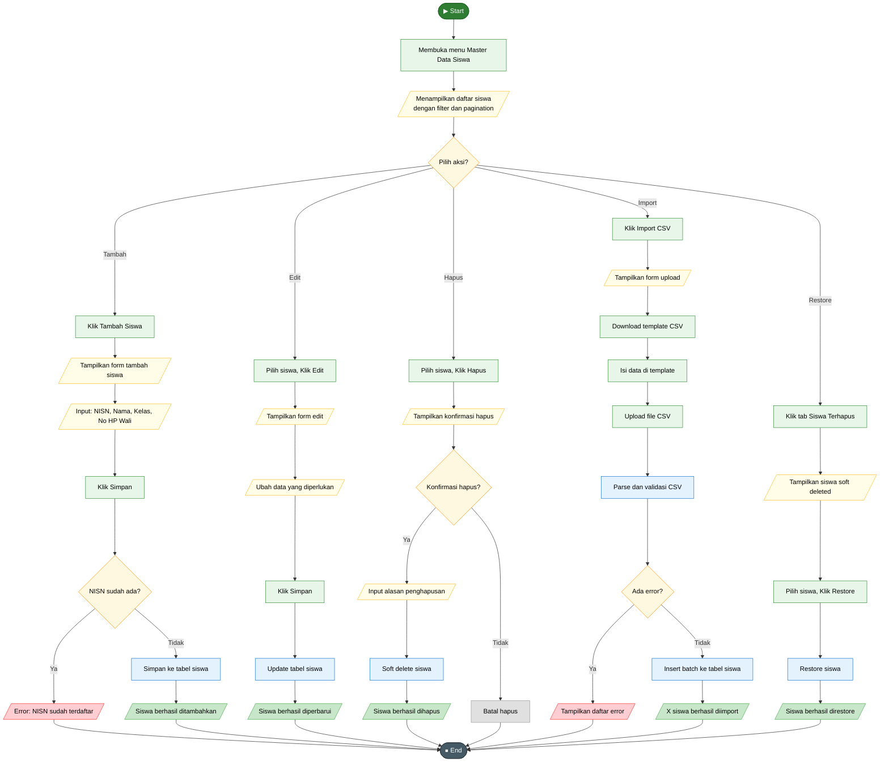

# Flowchart: Kelola Data Siswa

> **Referensi**: AD_02 - AD_06 (Tambah, Edit, Hapus, Import, Restore Siswa)  
> **Aktor**: Operator Sekolah

```mermaid
flowchart TD
    %% === TERMINATOR ===
    START(["▶ Start"])
    END1(["⏹ End"])

    %% === PROCESS - Operator ===
    A["Membuka menu Master Data Siswa"]

    %% === INPUT/OUTPUT ===
    B[/"Menampilkan daftar siswa<br>dengan filter dan pagination"/]

    %% === DECISION ===
    C{"Pilih aksi?"}

    %% ====== TAMBAH ======
    D1["Klik Tambah Siswa"]
    D2[/"Tampilkan form tambah siswa"/]
    D3[/"Input: NISN, Nama, Kelas, No HP Wali"/]
    D4["Klik Simpan"]
    D5{"NISN sudah ada?"}
    D6[/"Error: NISN sudah terdaftar"/]
    D7["Simpan ke tabel siswa"]
    D8[/"Siswa berhasil ditambahkan"/]

    %% ====== EDIT ======
    E1["Pilih siswa, Klik Edit"]
    E2[/"Tampilkan form edit"/]
    E3[/"Ubah data yang diperlukan"/]
    E4["Klik Simpan"]
    E5["Update tabel siswa"]
    E6[/"Siswa berhasil diperbarui"/]

    %% ====== HAPUS ======
    F1["Pilih siswa, Klik Hapus"]
    F2[/"Tampilkan konfirmasi hapus"/]
    F3{"Konfirmasi hapus?"}
    F4[/"Input alasan penghapusan"/]
    F5["Soft delete siswa"]
    F6[/"Siswa berhasil dihapus"/]
    F7["Batal hapus"]

    %% ====== IMPORT ======
    G1["Klik Import CSV"]
    G2[/"Tampilkan form upload"/]
    G3["Download template CSV"]
    G4["Isi data di template"]
    G5["Upload file CSV"]
    G6["Parse dan validasi CSV"]
    G7{"Ada error?"}
    G8[/"Tampilkan daftar error"/]
    G9["Insert batch ke tabel siswa"]
    G10[/"X siswa berhasil diimport"/]

    %% ====== RESTORE ======
    H1["Klik tab Siswa Terhapus"]
    H2[/"Tampilkan siswa soft deleted"/]
    H3["Pilih siswa, Klik Restore"]
    H4["Restore siswa"]
    H5[/"Siswa berhasil direstore"/]

    %% === FLOW ===
    START --> A --> B --> C

    C -->|Tambah| D1 --> D2 --> D3 --> D4 --> D5
    D5 -->|Ya| D6 --> END1
    D5 -->|Tidak| D7 --> D8 --> END1

    C -->|Edit| E1 --> E2 --> E3 --> E4 --> E5 --> E6 --> END1

    C -->|Hapus| F1 --> F2 --> F3
    F3 -->|Ya| F4 --> F5 --> F6 --> END1
    F3 -->|Tidak| F7 --> END1

    C -->|Import| G1 --> G2 --> G3 --> G4 --> G5 --> G6 --> G7
    G7 -->|Ya| G8 --> END1
    G7 -->|Tidak| G9 --> G10 --> END1

    C -->|Restore| H1 --> H2 --> H3 --> H4 --> H5 --> END1

    %% === STYLING ===
    %% Terminator (Dark bg, White text)
    style START fill:#2E7D32,stroke:#1B5E20,color:#fff
    style END1 fill:#455A64,stroke:#263238,color:#fff

    %% Operator (Green tint, Black text)
    style A fill:#E8F5E9,stroke:#388E3C,color:#000
    style D1 fill:#E8F5E9,stroke:#388E3C,color:#000
    style D4 fill:#E8F5E9,stroke:#388E3C,color:#000
    style E1 fill:#E8F5E9,stroke:#388E3C,color:#000
    style E4 fill:#E8F5E9,stroke:#388E3C,color:#000
    style F1 fill:#E8F5E9,stroke:#388E3C,color:#000
    style G1 fill:#E8F5E9,stroke:#388E3C,color:#000
    style G3 fill:#E8F5E9,stroke:#388E3C,color:#000
    style G4 fill:#E8F5E9,stroke:#388E3C,color:#000
    style G5 fill:#E8F5E9,stroke:#388E3C,color:#000
    style H1 fill:#E8F5E9,stroke:#388E3C,color:#000
    style H3 fill:#E8F5E9,stroke:#388E3C,color:#000

    %% Sistem (Blue tint, Black text)
    style D7 fill:#E3F2FD,stroke:#1976D2,color:#000
    style E5 fill:#E3F2FD,stroke:#1976D2,color:#000
    style F5 fill:#E3F2FD,stroke:#1976D2,color:#000
    style G6 fill:#E3F2FD,stroke:#1976D2,color:#000
    style G9 fill:#E3F2FD,stroke:#1976D2,color:#000
    style H4 fill:#E3F2FD,stroke:#1976D2,color:#000

    %% Output Success (Green tint, Black text)
    style D8 fill:#C8E6C9,stroke:#4CAF50,color:#000
    style E6 fill:#C8E6C9,stroke:#4CAF50,color:#000
    style F6 fill:#C8E6C9,stroke:#4CAF50,color:#000
    style G10 fill:#C8E6C9,stroke:#4CAF50,color:#000
    style H5 fill:#C8E6C9,stroke:#4CAF50,color:#000

    %% Output Error (Red/Gray tint, Black text)
    style D6 fill:#FFCDD2,stroke:#f44336,color:#000
    style G8 fill:#FFCDD2,stroke:#f44336,color:#000
    style F7 fill:#E0E0E0,stroke:#9E9E9E,color:#000

    %% Input/Output (Yellow tint, Black text)
    style B fill:#FFFDE7,stroke:#FBC02D,color:#000
    style D2 fill:#FFFDE7,stroke:#FBC02D,color:#000
    style D3 fill:#FFFDE7,stroke:#FBC02D,color:#000
    style E2 fill:#FFFDE7,stroke:#FBC02D,color:#000
    style E3 fill:#FFFDE7,stroke:#FBC02D,color:#000
    style F2 fill:#FFFDE7,stroke:#FBC02D,color:#000
    style F4 fill:#FFFDE7,stroke:#FBC02D,color:#000
    style G2 fill:#FFFDE7,stroke:#FBC02D,color:#000
    style H2 fill:#FFFDE7,stroke:#FBC02D,color:#000

    %% Decision (Orange tint, Black text)
    style C fill:#FFF8E1,stroke:#FF8F00,color:#000
    style D5 fill:#FFF8E1,stroke:#FF8F00,color:#000
    style F3 fill:#FFF8E1,stroke:#FF8F00,color:#000
    style G7 fill:#FFF8E1,stroke:#FF8F00,color:#000
```
