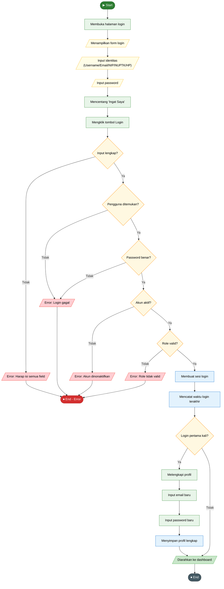

# Flowchart: Proses Login

> **Referensi**: AD_01_login.puml  
> **Aktor**: Semua Pengguna Sistem

```mermaid
flowchart TD
    %% === TERMINATOR ===
    START(["▶ Start"])
    END1(["⏹ End"])
    END2(["⏹ End - Error"])

    %% === PROCESS - Pengguna ===
    A["Membuka halaman login"]
    F["Mencentang 'Ingat Saya'"]
    G["Mengklik tombol Login"]
    P["Melengkapi profil"]
    Q["Input email baru"]
    R["Input password baru"]

    %% === INPUT/OUTPUT ===
    B[/"Input identitas<br>(Username/Email/NIP/NUPTK/HP)"/]
    C[/"Input password"/]
    D[/"Menampilkan form login"/]
    S[/"Diarahkan ke dashboard"/]

    %% === DECISION ===
    H{"Input lengkap?"}
    I{"Pengguna ditemukan?"}
    J{"Password benar?"}
    K{"Akun aktif?"}
    L{"Role valid?"}
    O{"Login pertama kali?"}

    %% === PROCESS - Sistem ===
    M["Membuat sesi login"]
    N["Mencatat waktu login terakhir"]
    T["Menyimpan profil lengkap"]

    %% === ERROR OUTPUT ===
    ERR1[/"Error: Harap isi semua field"/]
    ERR2[/"Error: Login gagal"/]
    ERR3[/"Error: Akun dinonaktifkan"/]
    ERR4[/"Error: Role tidak valid"/]

    %% === FLOW ===
    START --> A
    A --> D
    D --> B
    B --> C
    C --> F
    F --> G
    G --> H

    H -->|Ya| I
    H -->|Tidak| ERR1 --> END2

    I -->|Ya| J
    I -->|Tidak| ERR2 --> END2

    J -->|Ya| K
    J -->|Tidak| ERR2

    K -->|Ya| L
    K -->|Tidak| ERR3 --> END2

    L -->|Ya| M
    L -->|Tidak| ERR4 --> END2

    M --> N
    N --> O

    O -->|Ya| P --> Q --> R --> T --> S
    O -->|Tidak| S

    S --> END1

    %% === STYLING ===
    %% Terminator (Dark bg, White text)
    style START fill:#2E7D32,stroke:#1B5E20,color:#fff
    style END1 fill:#455A64,stroke:#263238,color:#fff
    style END2 fill:#D32F2F,stroke:#B71C1C,color:#fff

    %% Process (Green tint, Black text)
    style A fill:#E8F5E9,stroke:#388E3C,color:#000
    style F fill:#E8F5E9,stroke:#388E3C,color:#000
    style G fill:#E8F5E9,stroke:#388E3C,color:#000
    style P fill:#E8F5E9,stroke:#388E3C,color:#000
    style Q fill:#E8F5E9,stroke:#388E3C,color:#000
    style R fill:#E8F5E9,stroke:#388E3C,color:#000

    %% System (Blue tint, Black text)
    style M fill:#E3F2FD,stroke:#1976D2,color:#000
    style N fill:#E3F2FD,stroke:#1976D2,color:#000
    style T fill:#E3F2FD,stroke:#1976D2,color:#000

    %% Input/Output (Yellow tint, Black text)
    style B fill:#FFFDE7,stroke:#FBC02D,color:#000
    style C fill:#FFFDE7,stroke:#FBC02D,color:#000
    style D fill:#FFFDE7,stroke:#FBC02D,color:#000
    style S fill:#C8E6C9,stroke:#4CAF50,color:#000

    %% Error (Red tint, Black text)
    style ERR1 fill:#FFCDD2,stroke:#f44336,color:#000
    style ERR2 fill:#FFCDD2,stroke:#f44336,color:#000
    style ERR3 fill:#FFCDD2,stroke:#f44336,color:#000
    style ERR4 fill:#FFCDD2,stroke:#f44336,color:#000

    %% Decision (Orange tint, Black text)
    style H fill:#FFF8E1,stroke:#FF8F00,color:#000
    style I fill:#FFF8E1,stroke:#FF8F00,color:#000
    style J fill:#FFF8E1,stroke:#FF8F00,color:#000
    style K fill:#FFF8E1,stroke:#FF8F00,color:#000
    style L fill:#FFF8E1,stroke:#FF8F00,color:#000
    style O fill:#FFF8E1,stroke:#FF8F00,color:#000
```
