# Flowchart: Pembinaan Internal Siswa

> **Referensi**: AD_14_mulai_pembinaan.puml, AD_15_selesaikan_pembinaan.puml  
> **Aktor**: Pembina (Wali Kelas, Kaprodi, Waka Kesiswaan, Waka Sarana, Kepala Sekolah)

```mermaid
flowchart TD
    %% === TERMINATOR ===
    START(["▶ Start"])
    END1(["⏹ End"])
    END2(["⏹ End - Tunda"])

    %% === PROCESS - Pembina ===
    A["Membuka menu Siswa Perlu Pembinaan"]
    C["Memilih siswa untuk dibina"]
    E["Mengklik tombol Mulai Pembinaan"]
    G["Memanggil siswa untuk sesi pembinaan"]
    H["Melakukan pembinaan:<br>• Dialog dengan siswa<br>• Identifikasi akar masalah<br>• Berikan arahan dan motivasi"]
    K["Mengklik tombol Selesaikan Pembinaan"]
    N["Melakukan monitoring berkala"]
    O["Tunda untuk waktu lain"]

    %% === INPUT/OUTPUT ===
    B[/"Menampilkan daftar siswa<br>sesuai role pembina"/]
    D[/"Menampilkan detail siswa:<br>• Riwayat pelanggaran<br>• Total poin akumulasi<br>• Range pembinaan"/]
    I[/"Input catatan pembinaan:<br>• Kronologi sesi<br>• Respon siswa<br>• Kesepakatan"/]
    J[/"Input hasil pembinaan:<br>• Kesimpulan<br>• Rekomendasi<br>• Komitmen siswa"/]
    M[/"Tampilkan pesan:<br>'Pembinaan berhasil diselesaikan'"/]

    %% === DECISION ===
    F{"Siap memulai<br>pembinaan?"}

    %% === PROCESS - Sistem ===
    E1["Update status → SEDANG_DIBINA"]
    E2["Set dibina_oleh_user_id"]
    E3["Set dibina_at = now()"]
    L1["Update status → SELESAI"]
    L2["Set diselesaikan_oleh_user_id"]
    L3["Set selesai_at = now()"]
    L4["Simpan hasil_pembinaan"]
    L5["Log aktivitas ke activity_log"]

    %% === FLOW ===
    START --> A
    A --> B
    B --> C
    C --> D
    D --> F

    F -->|Ya| E
    F -->|Tidak| O --> END2

    E --> E1 --> E2 --> E3 --> G
    G --> H
    H --> I
    I --> J
    J --> K
    K --> L1 --> L2 --> L3 --> L4 --> L5 --> M
    M --> N
    N --> END1

    %% === STYLING ===
    %% Terminator (Dark bg, White text)
    style START fill:#2E7D32,stroke:#1B5E20,color:#fff
    style END1 fill:#455A64,stroke:#263238,color:#fff
    style END2 fill:#757575,stroke:#424242,color:#fff

    %% Pembina (Green tint, Black text)
    style A fill:#E8F5E9,stroke:#388E3C,color:#000
    style C fill:#E8F5E9,stroke:#388E3C,color:#000
    style E fill:#E8F5E9,stroke:#388E3C,color:#000
    style G fill:#E8F5E9,stroke:#388E3C,color:#000
    style H fill:#E8F5E9,stroke:#388E3C,color:#000
    style K fill:#E8F5E9,stroke:#388E3C,color:#000
    style N fill:#E8F5E9,stroke:#388E3C,color:#000
    style O fill:#E0E0E0,stroke:#9E9E9E,color:#000

    %% Sistem (Blue tint, Black text)
    style E1 fill:#E3F2FD,stroke:#1976D2,color:#000
    style E2 fill:#E3F2FD,stroke:#1976D2,color:#000
    style E3 fill:#E3F2FD,stroke:#1976D2,color:#000
    style L1 fill:#E3F2FD,stroke:#1976D2,color:#000
    style L2 fill:#E3F2FD,stroke:#1976D2,color:#000
    style L3 fill:#E3F2FD,stroke:#1976D2,color:#000
    style L4 fill:#E3F2FD,stroke:#1976D2,color:#000
    style L5 fill:#E3F2FD,stroke:#1976D2,color:#000

    %% Input/Output (Yellow tint, Black text)
    style B fill:#FFFDE7,stroke:#FBC02D,color:#000
    style D fill:#FFFDE7,stroke:#FBC02D,color:#000
    style I fill:#FFFDE7,stroke:#FBC02D,color:#000
    style J fill:#FFFDE7,stroke:#FBC02D,color:#000
    style M fill:#C8E6C9,stroke:#4CAF50,color:#000

    %% Decision (Orange tint, Black text)
    style F fill:#FFF8E1,stroke:#FF8F00,color:#000
```

