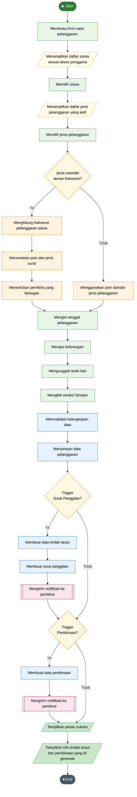

# Flowchart: Pencatatan Pelanggaran

> **Referensi**: AD_07_catat_pelanggaran.puml  
> **Aktor**: Pencatat (Guru, Wali Kelas, Kaprodi, Waka Kesiswaan, Waka Sarana, Operator)

```mermaid
flowchart TD
    %% === TERMINATOR ===
    START(["▶ Start"])
    END1(["⏹ End"])

    %% === PROCESS - Pencatat ===
    A["Membuka form catat pelanggaran"]
    C["Memilih siswa"]
    D["Memilih jenis pelanggaran"]
    G["Mengisi tanggal pelanggaran"]
    H["Mengisi keterangan"]
    I["Mengunggah bukti foto"]
    J["Mengklik tombol Simpan"]

    %% === INPUT/OUTPUT ===
    B[/"Menampilkan daftar siswa<br>sesuai akses pengguna"/]
    E[/"Menampilkan daftar jenis<br>pelanggaran yang aktif"/]
    R[/"Tampilkan pesan sukses"/]
    S[/"Tampilkan info tindak lanjut<br>dan pembinaan yang di-generate"/]

    %% === DECISION ===
    F{"Jenis memiliki<br>aturan frekuensi?"}
    L{"Trigger<br>Surat Panggilan?"}
    O{"Trigger<br>Pembinaan?"}

    %% === PROCESS - Rules Engine ===
    F1["Menghitung frekuensi pelanggaran siswa"]
    F2["Menentukan poin dan jenis surat"]
    F3["Menentukan pembina yang bertugas"]
    F4["Menggunakan poin standar jenis pelanggaran"]

    %% === PROCESS - Sistem ===
    K["Memvalidasi kelengkapan data"]
    K1["Menyimpan data pelanggaran"]
    M["Membuat data tindak lanjut"]
    N["Membuat surat panggilan"]
    P["Membuat data pembinaan"]

    %% === PREDEFINED PROCESS ===
    N1[["Mengirim notifikasi ke pembina"]]
    Q[["Mengirim notifikasi ke pembina"]]

    %% === FLOW ===
    START --> A
    A --> B
    B --> C
    C --> E
    E --> D
    D --> F

    F -->|Ya| F1 --> F2 --> F3 --> G
    F -->|Tidak| F4 --> G

    G --> H
    H --> I
    I --> J
    J --> K
    K --> K1
    K1 --> L

    L -->|Ya| M --> N --> N1 --> O
    L -->|Tidak| O

    O -->|Ya| P --> Q --> R
    O -->|Tidak| R

    R --> S
    S --> END1

    %% === STYLING ===
    %% Terminator (Dark bg, White text)
    style START fill:#2E7D32,stroke:#1B5E20,color:#fff
    style END1 fill:#455A64,stroke:#263238,color:#fff

    %% Pencatat (Green tint, Black text)
    style A fill:#E8F5E9,stroke:#388E3C,color:#000
    style C fill:#E8F5E9,stroke:#388E3C,color:#000
    style D fill:#E8F5E9,stroke:#388E3C,color:#000
    style G fill:#E8F5E9,stroke:#388E3C,color:#000
    style H fill:#E8F5E9,stroke:#388E3C,color:#000
    style I fill:#E8F5E9,stroke:#388E3C,color:#000
    style J fill:#E8F5E9,stroke:#388E3C,color:#000

    %% Rules Engine (Orange tint, Black text)
    style F1 fill:#FFF3E0,stroke:#FF8F00,color:#000
    style F2 fill:#FFF3E0,stroke:#FF8F00,color:#000
    style F3 fill:#FFF3E0,stroke:#FF8F00,color:#000
    style F4 fill:#FFF3E0,stroke:#FF8F00,color:#000

    %% Sistem (Blue tint, Black text)
    style K fill:#E3F2FD,stroke:#1976D2,color:#000
    style K1 fill:#E3F2FD,stroke:#1976D2,color:#000
    style M fill:#E3F2FD,stroke:#1976D2,color:#000
    style N fill:#E3F2FD,stroke:#1976D2,color:#000
    style P fill:#E3F2FD,stroke:#1976D2,color:#000

    %% Notifikasi (Pink tint, Black text)
    style N1 fill:#FCE4EC,stroke:#C2185B,color:#000
    style Q fill:#FCE4EC,stroke:#C2185B,color:#000

    %% Output (Yellow/Green tint, Black text)
    style B fill:#FFFDE7,stroke:#FBC02D,color:#000
    style E fill:#FFFDE7,stroke:#FBC02D,color:#000
    style R fill:#C8E6C9,stroke:#4CAF50,color:#000
    style S fill:#C8E6C9,stroke:#4CAF50,color:#000

    %% Decision (Orange tint, Black text)
    style F fill:#FFF8E1,stroke:#FF8F00,color:#000
    style L fill:#FFF8E1,stroke:#FF8F00,color:#000
    style O fill:#FFF8E1,stroke:#FF8F00,color:#000
```
