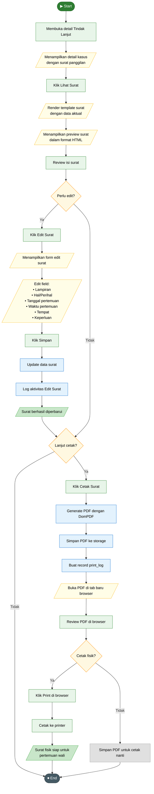

# Flowchart: Kelola Surat Panggilan

> **Referensi**: AD_11 - AD_13 (Preview, Edit, Cetak Surat Panggilan)  
> **Aktor**: Pembina (Wali Kelas, Kaprodi, Waka Kesiswaan, Waka Sarana)

```mermaid
flowchart TD
    %% === TERMINATOR ===
    START(["▶ Start"])
    END1(["⏹ End"])

    %% === PROCESS - Pembina ===
    A["Membuka detail Tindak Lanjut"]
    C["Klik Lihat Surat"]
    F["Review isi surat"]
    H["Klik Edit Surat"]
    K["Klik Simpan"]
    N["Klik Cetak Surat"]
    S["Review PDF di browser"]
    U["Klik Print di browser"]
    V["Cetak ke printer"]
    X["Simpan PDF untuk cetak nanti"]

    %% === INPUT/OUTPUT ===
    B[/"Menampilkan detail kasus<br>dengan surat panggilan"/]
    D[/"Render template surat<br>dengan data aktual"/]
    E[/"Menampilkan preview surat<br>dalam format HTML"/]
    I[/"Menampilkan form edit surat"/]
    J[/"Edit field:<br>• Lampiran<br>• Hal/Perihal<br>• Tanggal pertemuan<br>• Waktu pertemuan<br>• Tempat<br>• Keperluan"/]
    M[/"Surat berhasil diperbarui"/]
    R[/"Buka PDF di tab baru browser"/]
    W[/"Surat fisik siap untuk<br>pertemuan wali"/]

    %% === DECISION ===
    G{"Perlu edit?"}
    L{"Lanjut cetak?"}
    T{"Cetak fisik?"}

    %% === PROCESS - Sistem ===
    K1["Update data surat"]
    K2["Log aktivitas Edit Surat"]
    O["Generate PDF dengan DomPDF"]
    P["Simpan PDF ke storage"]
    Q["Buat record print_log"]

    %% === FLOW ===
    START --> A
    A --> B
    B --> C
    C --> D
    D --> E
    E --> F
    F --> G

    G -->|Ya| H --> I --> J --> K --> K1 --> K2 --> M --> L
    G -->|Tidak| L

    L -->|Ya| N --> O --> P --> Q --> R --> S --> T
    L -->|Tidak| END1

    T -->|Ya| U --> V --> W --> END1
    T -->|Tidak| X --> END1

    %% === STYLING ===
    %% Terminator (Dark bg, White text)
    style START fill:#2E7D32,stroke:#1B5E20,color:#fff
    style END1 fill:#455A64,stroke:#263238,color:#fff

    %% Pembina (Green tint, Black text)
    style A fill:#E8F5E9,stroke:#388E3C,color:#000
    style C fill:#E8F5E9,stroke:#388E3C,color:#000
    style F fill:#E8F5E9,stroke:#388E3C,color:#000
    style H fill:#E8F5E9,stroke:#388E3C,color:#000
    style K fill:#E8F5E9,stroke:#388E3C,color:#000
    style N fill:#E8F5E9,stroke:#388E3C,color:#000
    style S fill:#E8F5E9,stroke:#388E3C,color:#000
    style U fill:#E8F5E9,stroke:#388E3C,color:#000
    style V fill:#E8F5E9,stroke:#388E3C,color:#000
    style X fill:#E0E0E0,stroke:#9E9E9E,color:#000

    %% Sistem (Blue tint, Black text)
    style K1 fill:#E3F2FD,stroke:#1976D2,color:#000
    style K2 fill:#E3F2FD,stroke:#1976D2,color:#000
    style O fill:#E3F2FD,stroke:#1976D2,color:#000
    style P fill:#E3F2FD,stroke:#1976D2,color:#000
    style Q fill:#E3F2FD,stroke:#1976D2,color:#000

    %% Input/Output (Yellow/Green tint, Black text)
    style B fill:#FFFDE7,stroke:#FBC02D,color:#000
    style D fill:#FFFDE7,stroke:#FBC02D,color:#000
    style E fill:#FFFDE7,stroke:#FBC02D,color:#000
    style I fill:#FFFDE7,stroke:#FBC02D,color:#000
    style J fill:#FFFDE7,stroke:#FBC02D,color:#000
    style R fill:#FFFDE7,stroke:#FBC02D,color:#000
    style M fill:#C8E6C9,stroke:#4CAF50,color:#000
    style W fill:#C8E6C9,stroke:#4CAF50,color:#000

    %% Decision (Orange tint, Black text)
    style G fill:#FFF8E1,stroke:#FF8F00,color:#000
    style L fill:#FFF8E1,stroke:#FF8F00,color:#000
    style T fill:#FFF8E1,stroke:#FF8F00,color:#000
```
