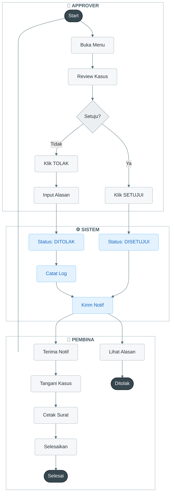

# Enterprise Swimlane Activity Diagram: Approval Tindak Lanjut

```mermaid
flowchart TD
    %% =================================================================================
    %% GLOBAL STYLES
    %% =================================================================================
    classDef activity fill:#F5F7F8,stroke:#B0BEC5,stroke-width:1px,color:#263238,rx:5,ry:5;
    classDef processing fill:#E3F2FD,stroke:#90CAF9,stroke-width:1px,color:#1565C0,rx:5,ry:5;
    classDef decision fill:#ECEFF1,stroke:#90A4AE,stroke-width:1px,color:#263238;
    classDef terminator fill:#37474F,stroke:#263238,stroke-width:2px,color:#FFFFFF,rx:50,ry:50;
    classDef lane fill:#FFFFFF,stroke:#CFD8DC,stroke-width:2px,color:#455A64,font-weight:bold;

    %% =================================================================================
    %% SWIMLANE DEFINITIONS (FORCE VERTICAL COLUMNS)
    %% =================================================================================

    subgraph APPROVER ["🔐 APPROVER"]
        direction TB
        START([Start]):::terminator
        A[Buka Menu]:::activity
        B[Review Kasus]:::activity
        C{Setuju?}:::decision
        D[Klik SETUJUI]:::activity
        E[Klik TOLAK]:::activity
        F[Input Alasan]:::activity
    end

    subgraph SISTEM ["⚙️ SISTEM"]
        direction TB
        %% Spacer Node untuk Alignment Header
        S_START[ ]:::hidden

        G[Status: DISETUJUI]:::processing
        H[Kirim Notif]:::processing
        I[Status: DITOLAK]:::processing
        J[Catat Log]:::processing
    end

    subgraph PEMBINA ["👤 PEMBINA"]
        direction TB
        %% Spacer Node untuk Alignment Header
        P_START[ ]:::hidden

        K[Terima Notif]:::activity
        L[Tangani Kasus]:::activity
        M[Cetak Surat]:::activity
        N[Selesaikan]:::activity
        O[Lihat Alasan]:::activity
        END_OK([Selesai]):::terminator
        END_NO([Ditolak]):::terminator
    end

    %% =================================================================================
    %% FORCING COLUMN ALIGNMENT (Horizontal Links at Top)
    %% =================================================================================
    START ~~~ S_START ~~~ P_START

    %% =================================================================================
    %% FLOW LOGIC
    %% =================================================================================
    START --> A --> B --> C

    %% Branch: REJECT
    C -- Tidak --> E --> F --> I --> J --> H
    H --> O --> END_NO

    %% Branch: APPROVE
    C -- Ya --> D --> G --> H
    H --> K --> L --> M --> N --> END_OK

    %% =================================================================================
    %% STYLING & CLASS
    %% =================================================================================
    class APPROVER,SISTEM,PEMBINA lane;
    classDef hidden display:none;
    linkStyle default stroke:#546E7A,stroke-width:1px,fill:none;
```
