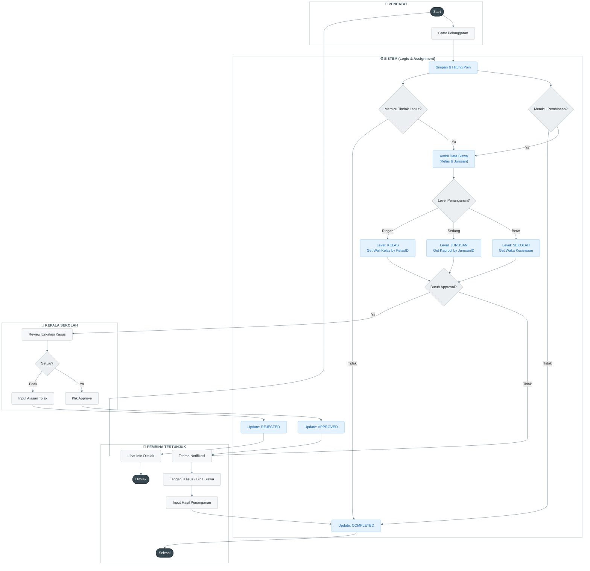

# Enterprise Swimlane: Detail Alur Penugasan & Penanganan

```mermaid
flowchart TD
    %% =================================================================================
    %% GLOBAL STYLES
    %% =================================================================================
    classDef activity fill:#F5F7F8,stroke:#B0BEC5,stroke-width:1px,color:#263238,rx:5,ry:5;
    classDef processing fill:#E3F2FD,stroke:#90CAF9,stroke-width:1px,color:#1565C0,rx:5,ry:5;
    classDef decision fill:#ECEFF1,stroke:#90A4AE,stroke-width:1px,color:#263238;
    classDef terminator fill:#37474F,stroke:#263238,stroke-width:2px,color:#FFFFFF,rx:50,ry:50;
    classDef lane fill:#FFFFFF,stroke:#CFD8DC,stroke-width:2px,color:#455A64,font-weight:bold;

    %% =================================================================================
    %% COL 1: PENCATAT (INPUT)
    %% =================================================================================
    subgraph PENCATAT ["📝 PENCATAT"]
        direction TB
        START([Start]):::terminator
        A["Catat Pelanggaran"]:::activity
    end

    %% =================================================================================
    %% COL 2: SISTEM (LOGIC CENTER)
    %% =================================================================================
    subgraph SISTEM ["⚙️ SISTEM (Logic & Assignment)"]
        direction TB
        S_START[ ]:::hidden

        %% --- STEP 1: CALCULATE ---
        B["Simpan & Hitung Poin"]:::processing

        %% --- STEP 2: BRANCHING CHECKS ---
        C_TL{"Memicu Tindak Lanjut?"}:::decision
        C_BINA{"Memicu Pembinaan?"}:::decision

        %% --- LOGIC: MENENTUKAN PEMBINA (Rules Engine) ---
        D["Ambil Data Siswa <br>(Kelas & Jurusan)"]:::processing

        E{"Level Penanganan?"}:::decision

        %% Assignment Process
        F1["Level: KELAS<br>Get Wali Kelas by KelasID"]:::processing
        F2["Level: JURUSAN<br>Get Kaprodi by JurusanID"]:::processing
        F3["Level: SEKOLAH<br>Get Waka Kesiswaan"]:::processing

        %% Approval Logic
        G{"Butuh Approval?"}:::decision

        %% Status
        STATUS_REJ["Update: REJECTED"]:::processing
        STATUS_APP["Update: APPROVED"]:::processing
        STATUS_DONE["Update: COMPLETED"]:::processing
    end

    %% =================================================================================
    %% COL 3: KEPALA SEKOLAH (APPROVAL)
    %% =================================================================================
    subgraph KEPSEK ["🔐 KEPALA SEKOLAH"]
        direction TB
        K_START[ ]:::hidden

        H["Review Eskalasi Kasus"]:::activity
        I{"Setuju?"}:::decision
        J["Input Alasan Tolak"]:::activity
        K["Klik Approve"]:::activity
    end

    %% =================================================================================
    %% COL 4: PEMBINA (EKSEKUTOR)
    %% =================================================================================
    subgraph PEMBINA ["👤 PEMBINA TERTUNJUK"]
        direction TB
        P_START[ ]:::hidden

        %% Notification
        L["Terima Notifikasi"]:::activity

        %% Action
        M["Tangani Kasus / Bina Siswa"]:::activity
        N["Input Hasil Penanganan"]:::activity

        %% Rejection Info
        O["Lihat Info Ditolak"]:::activity

        END_OK([Selesai]):::terminator
        END_REJ([Ditolak]):::terminator
    end

    %% =================================================================================
    %% ALIGNMENT FORCING
    %% =================================================================================
    START ~~~ S_START ~~~ K_START ~~~ P_START

    %% =================================================================================
    %% FLOW LOGIC
    %% =================================================================================

    %% 1. Pencatatan ke Sistem
    START --> A --> B

    %% 2. Parallel Checks
    B --> C_TL
    B --> C_BINA

    %% Jika TIDAK ada trigger -> Langsung done (simulated logic link to end)
    C_TL -- Tidak --> STATUS_DONE
    C_BINA -- Tidak --> STATUS_DONE

    %% Jika YA -> Masuk Logic Penentuan Pembina
    C_TL -- Ya --> D
    C_BINA -- Ya --> D

    %% 3. Logic Assignment (Siapa yang menangani?)
    D --> E

    E -- Ringan --> F1
    E -- Sedang --> F2
    E -- Berat --> F3

    %% 4. Approval Check (Hanya untuk TL Berat biasanya)
    F1 --> G
    F2 --> G
    F3 --> G

    %% 5. Alur Approval
    G -- Ya --> H
    H --> I

    %% Reject
    I -- Tidak --> J --> STATUS_REJ
    STATUS_REJ --> O --> END_REJ

    %% Approve
    I -- Ya --> K --> STATUS_APP

    %% 6. Dispatch ke Pembina (Wali/Kaprodi/Waka sesuai F1/F2/F3)
    G -- Tidak --> L
    STATUS_APP --> L

    %% 7. Eksekusi Pembina
    L --> M --> N --> STATUS_DONE
    STATUS_DONE --> END_OK

    %% =================================================================================
    %% STYLING
    %% =================================================================================
    class PENCATAT,SISTEM,KEPSEK,PEMBINA lane;
    classDef hidden display:none;
    linkStyle default stroke:#546E7A,stroke-width:1px,fill:none;
```
