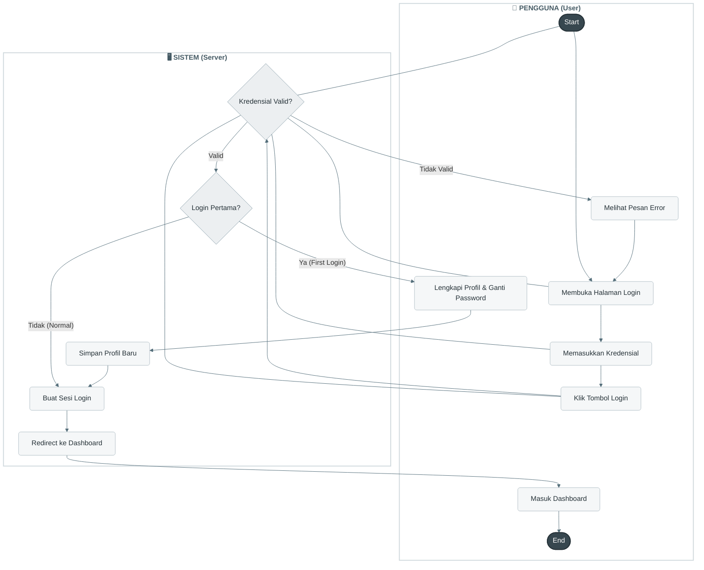

# Enterprise Swimlane Activity Diagram: Login Process

```mermaid
flowchart TD
    %% =================================================================================
    %% GLOBAL STYLES (ENTERPRISE MINIMALIST THEME)
    %% =================================================================================
    %% Kotak Aktivitas: Abu-abu sangat muda, Border abu-abu, Teks hitam, Rounded
    classDef activity fill:#F5F7F8,stroke:#B0BEC5,stroke-width:1px,color:#263238,rx:5,ry:5;

    %% Decision: Diamond, warna sama
    classDef decision fill:#ECEFF1,stroke:#90A4AE,stroke-width:1px,color:#263238;

    %% Start/End: Lingkaran solid gelap
    classDef terminator fill:#37474F,stroke:#263238,stroke-width:2px,color:#FFFFFF,rx:50,ry:50;

    %% Swimlane Header
    classDef lane fill:#FFFFFF,stroke:#CFD8DC,stroke-width:2px,color:#455A64,font-weight:bold;

    %% =================================================================================
    %% SWIMLANE: PENGGUNA
    %% =================================================================================
    subgraph PENGGUNA ["👤 PENGGUNA (User)"]
        direction TB
        START([Start]):::terminator
        A[Membuka Halaman Login]:::activity
        B[Memasukkan Kredensial]:::activity
        C[Klik Tombol Login]:::activity
        F[Lengkapi Profil & Ganti Password]:::activity
        DASH[Masuk Dashboard]:::activity
        ERR[Melihat Pesan Error]:::activity
        END([End]):::terminator
    end

    %% =================================================================================
    %% SWIMLANE: SISTEM
    %% =================================================================================
    subgraph SISTEM ["🖥️ SISTEM (Server)"]
        direction TB
        D{Kredensial Valid?}:::decision
        E{Login Pertama?}:::decision
        G[Simpan Profil Baru]:::activity
        H[Buat Sesi Login]:::activity
        I[Redirect ke Dashboard]:::activity
    end

    %% =================================================================================
    %% ALIGNMENT TWEAKS (Invisible Links untuk kesejajaran)
    %% =================================================================================
    START ~~~ D
    A ~~~ D
    B ~~~ D
    C ~~~ D

    %% =================================================================================
    %% FLOW LOGIC (Linear Top-Down)
    %% =================================================================================
    %% 1. User Start
    START --> A
    A --> B
    B --> C

    %% 2. Cross to System
    C --> D

    %% 3. System Validation
    D -- Tidak Valid --> ERR
    D -- Valid --> E

    %% 4. Login Pertama Check
    E -- Ya (First Login) --> F
    E -- Tidak (Normal) --> H

    %% 5. First Login Loop
    F --> G
    G --> H

    %% 6. Finalize Login
    H --> I
    I --> DASH

    %% 7. End Points
    DASH --> END
    ERR --> A

    %% =================================================================================
    %% STYLE APPLICATION
    %% =================================================================================
    class PENGGUNA,SISTEM lane;

    %% Link Style: Siku-siku (Orthogonal) - Default di Mermaid flowchart TD cukup rapi
    linkStyle default stroke:#546E7A,stroke-width:1px,fill:none;
```
