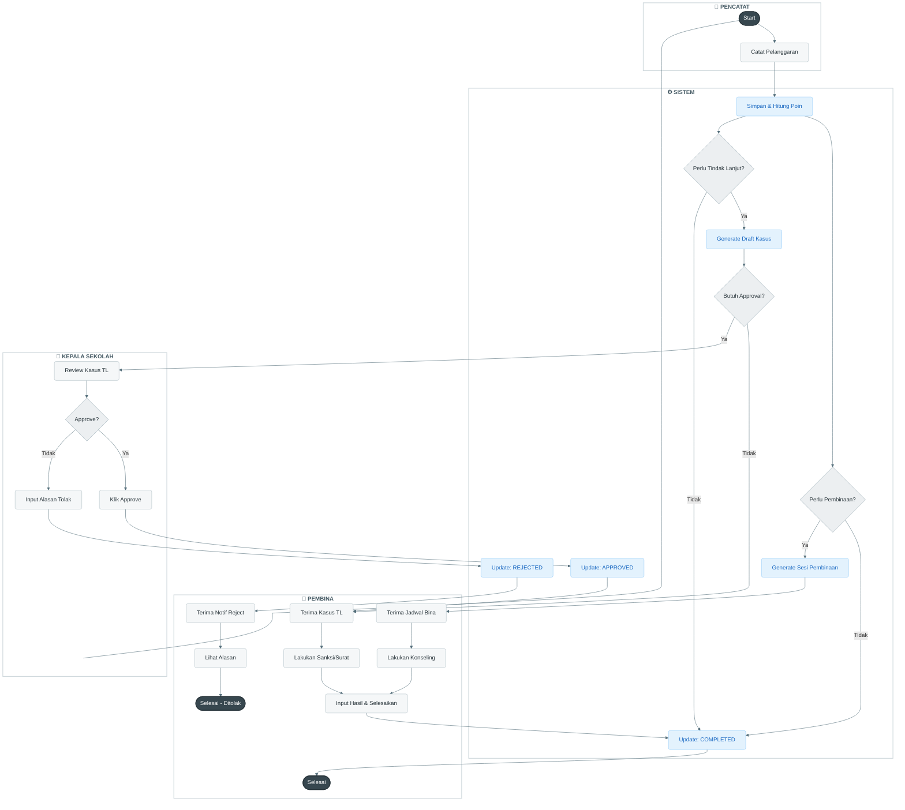

# Enterprise Swimlane: Alur Utama Sistem Kedisiplinan

```mermaid
flowchart TD
    %% =================================================================================
    %% GLOBAL STYLES (ENTERPRISE THEME)
    %% =================================================================================
    classDef activity fill:#F5F7F8,stroke:#B0BEC5,stroke-width:1px,color:#263238,rx:5,ry:5;
    classDef processing fill:#E3F2FD,stroke:#90CAF9,stroke-width:1px,color:#1565C0,rx:5,ry:5;
    classDef decision fill:#ECEFF1,stroke:#90A4AE,stroke-width:1px,color:#263238;
    classDef terminator fill:#37474F,stroke:#263238,stroke-width:2px,color:#FFFFFF,rx:50,ry:50;
    classDef lane fill:#FFFFFF,stroke:#CFD8DC,stroke-width:2px,color:#455A64,font-weight:bold;

    %% =================================================================================
    %% COL 1: PENCATAT
    %% =================================================================================
    subgraph PENCATAT ["📝 PENCATAT"]
        direction TB
        START([Start]):::terminator
        A[Catat Pelanggaran]:::activity
    end

    %% =================================================================================
    %% COL 2: SISTEM
    %% =================================================================================
    subgraph SISTEM ["⚙️ SISTEM"]
        direction TB
        S_START[ ]:::hidden

        B[Simpan & Hitung Poin]:::processing

        %% --- PARALLEL CHECKS ---
        C_TL{Perlu Tindak Lanjut?}:::decision
        C_BINA{Perlu Pembinaan?}:::decision

        %% --- TL FLOW ---
        D[Generate Draft Kasus]:::processing
        E{Butuh Approval?}:::decision

        %% Status Updates (TL)
        F[Update: REJECTED]:::processing
        G[Update: APPROVED]:::processing

        %% --- BINA FLOW ---
        H[Generate Sesi Pembinaan]:::processing

        %% --- CLOSING ---
        FINAL[Update: COMPLETED]:::processing
    end

    %% =================================================================================
    %% COL 3: PEMBINA (Wali Kelas/Kaprodi/Waka)
    %% =================================================================================
    subgraph PEMBINA ["👤 PEMBINA"]
        direction TB
        P_START[ ]:::hidden

        I[Terima Notif Reject]:::activity
        J[Lihat Alasan]:::activity

        K[Terima Kasus TL]:::activity
        L[Lakukan Sanksi/Surat]:::activity

        M[Terima Jadwal Bina]:::activity
        N[Lakukan Konseling]:::activity

        O[Input Hasil & Selesaikan]:::activity

        END_OK([Selesai]):::terminator
        END_REJ([Selesai - Ditolak]):::terminator
    end

    %% =================================================================================
    %% COL 4: KEPALA SEKOLAH
    %% =================================================================================
    subgraph KEPSEK ["🔐 KEPALA SEKOLAH"]
        direction TB
        K_START[ ]:::hidden

        P[Review Kasus TL]:::activity
        Q{Approve?}:::decision
        R[Input Alasan Tolak]:::activity
        S[Klik Approve]:::activity
    end

    %% =================================================================================
    %% FORCING COLUMN ALIGNMENT
    %% =================================================================================
    START ~~~ S_START ~~~ P_START ~~~ K_START

    %% =================================================================================
    %% FLOW LOGIC
    %% =================================================================================

    %% 1. Pencatatan
    START --> A
    A --> B

    %% 2. Split Check (Parallel Logic)
    B --> C_TL
    B --> C_BINA

    %% === ALUR TINDAK LANJUT (Surat/Sanksi) ===
    C_TL -- Tidak --> FINAL
    C_TL -- Ya --> D
    D --> E

    %% Approval Check
    E -- Ya --> P
    P --> Q

    %% Reject
    Q -- Tidak --> R
    R --> F
    F --> I
    I --> J
    J --> END_REJ

    %% Approve / No Approval Needed
    Q -- Ya --> S
    S --> G

    G --> K
    E -- Tidak --> K

    K --> L
    L --> O

    %% === ALUR PEMBINAAN (Konseling/Coaching) ===
    C_BINA -- Ya --> H
    H --> M
    M --> N
    N --> O

    C_BINA -- Tidak --> FINAL

    %% === MERGE & FINISH ===
    O --> FINAL
    FINAL --> END_OK

    %% =================================================================================
    %% STYLING
    %% =================================================================================
    class PENCATAT,SISTEM,PEMBINA,KEPSEK lane;
    classDef hidden display:none;
    linkStyle default stroke:#546E7A,stroke-width:1px,fill:none;
```
