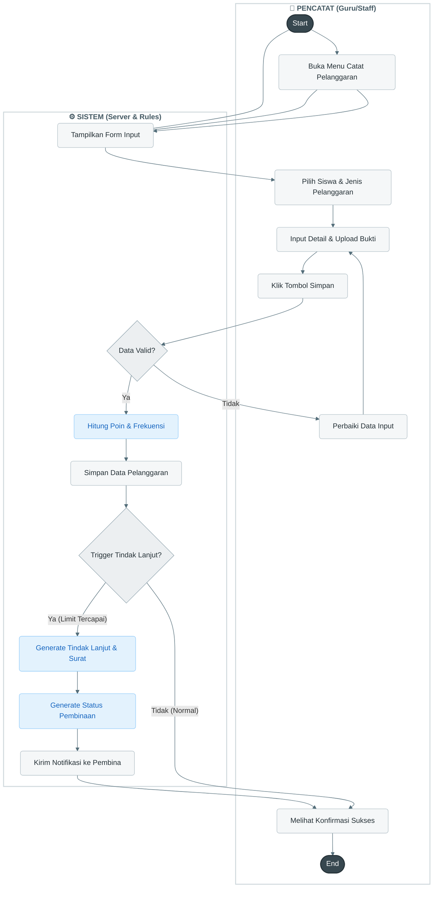

# Enterprise Swimlane Activity Diagram: Pencatatan Pelanggaran

```mermaid
flowchart TD
    %% =================================================================================
    %% GLOBAL STYLES (ENTERPRISE MINIMALIST THEME)
    %% =================================================================================
    classDef activity fill:#F5F7F8,stroke:#B0BEC5,stroke-width:1px,color:#263238,rx:5,ry:5;
    classDef processing fill:#E3F2FD,stroke:#90CAF9,stroke-width:1px,color:#1565C0,rx:5,ry:5;
    classDef decision fill:#ECEFF1,stroke:#90A4AE,stroke-width:1px,color:#263238;
    classDef terminator fill:#37474F,stroke:#263238,stroke-width:2px,color:#FFFFFF,rx:50,ry:50;
    classDef lane fill:#FFFFFF,stroke:#CFD8DC,stroke-width:2px,color:#455A64,font-weight:bold;

    %% =================================================================================
    %% SWIMLANE: PENCATAT (Guru/Staff)
    %% =================================================================================
    subgraph PENCATAT ["📝 PENCATAT (Guru/Staff)"]
        direction TB
        START([Start]):::terminator
        A[Buka Menu Catat Pelanggaran]:::activity
        B[Pilih Siswa & Jenis Pelanggaran]:::activity
        C[Input Detail & Upload Bukti]:::activity
        D[Klik Tombol Simpan]:::activity
        MSG[Melihat Konfirmasi Sukses]:::activity
        ERR[Perbaiki Data Input]:::activity
        END([End]):::terminator
    end

    %% =================================================================================
    %% SWIMLANE: SISTEM (Server & Rules Engine)
    %% =================================================================================
    subgraph SISTEM ["⚙️ SISTEM (Server & Rules)"]
        direction TB
        E[Tampilkan Form Input]:::activity
        F{Data Valid?}:::decision
        G[Hitung Poin & Frekuensi]:::processing
        H{Trigger Tindak Lanjut?}:::decision
        I[Simpan Data Pelanggaran]:::activity
        J[Generate Tindak Lanjut & Surat]:::processing
        K[Generate Status Pembinaan]:::processing
        L[Kirim Notifikasi ke Pembina]:::activity
    end

    %% =================================================================================
    %% ALIGNMENT (Invisible Links)
    %% =================================================================================
    START ~~~ E
    A ~~~ E

    %% =================================================================================
    %% FLOW LOGIC
    %% =================================================================================
    %% 1. Init
    START --> A
    A --> E
    E --> B
    B --> C
    C --> D

    %% 2. Validation
    D --> F
    F -- Tidak --> ERR
    ERR --> C

    %% 3. Rules Engine Processing
    F -- Ya --> G
    G --> I
    I --> H

    %% 4. Auto-Trigger Logic
    H -- Ya (Limit Tercapai) --> J
    J --> K
    K --> L
    L --> MSG

    H -- Tidak (Normal) --> MSG

    %% 5. Finish
    MSG --> END

    %% =================================================================================
    %% STYLE APPLICATION
    %% =================================================================================
    class PENCATAT,SISTEM lane;
    linkStyle default stroke:#546E7A,stroke-width:1px,fill:none;
```
