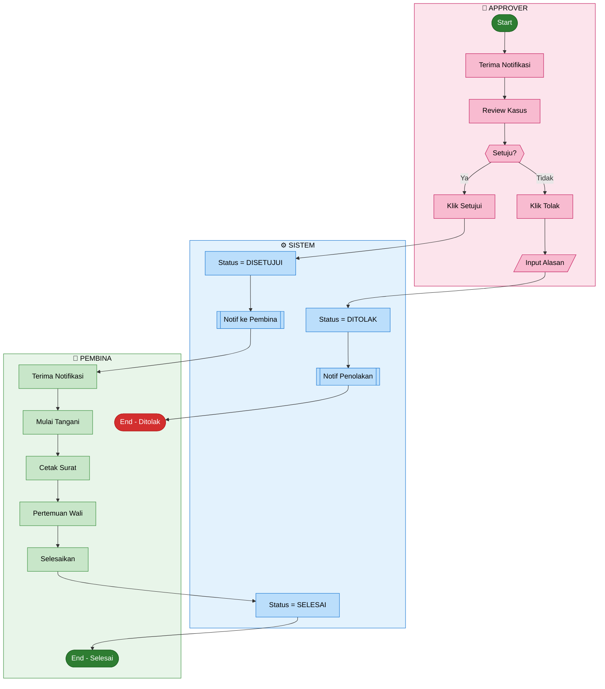

# Flowchart Approval (Swimlane)

```mermaid
flowchart TD
    %% === SWIMLANE: APPROVER ===
    subgraph APPROVER["🔐 APPROVER"]
        direction TB
        START([Start])
        A["Terima Notifikasi"]
        B["Review Kasus"]
        C{{"Setuju?"}}
        D["Klik Setujui"]
        E["Klik Tolak"]
        F[/"Input Alasan"/]
    end

    %% === SWIMLANE: SISTEM ===
    subgraph SISTEM["⚙️ SISTEM"]
        direction TB
        G["Status = DISETUJUI"]
        H[["Notif ke Pembina"]]
        I["Status = DITOLAK"]
        J[["Notif Penolakan"]]
        K["Status = SELESAI"]
    end

    %% === SWIMLANE: PEMBINA ===
    subgraph PEMBINA["👤 PEMBINA"]
        direction TB
        L["Terima Notifikasi"]
        M["Mulai Tangani"]
        N["Cetak Surat"]
        O["Pertemuan Wali"]
        P["Selesaikan"]
        END_OK([End - Selesai])
        END_NO([End - Ditolak])
    end

    %% === FLOW (Urutan Logis agar Sejajar) ===
    START --> A
    A --> B
    B --> C

    %% Branch Setuju (Lurus ke bawah lalu pindah lane)
    C -->|Ya| D
    D --> G
    G --> H
    H --> L

    L --> M
    M --> N
    N --> O
    O --> P
    P --> K
    K --> END_OK

    %% Branch Tolak (Geser ke samping)
    C -->|Tidak| E
    E --> F
    F --> I
    I --> J
    J --> END_NO

    %% === STYLING (Kontras Tinggi) ===
    %% Terminator
    style START fill:#2E7D32,stroke:#1B5E20,color:#fff
    style END_OK fill:#2E7D32,stroke:#1B5E20,color:#fff
    style END_NO fill:#D32F2F,stroke:#B71C1C,color:#fff

    %% Lanes with Border & Header
    style APPROVER fill:#FCE4EC,stroke:#C2185B,color:#000
    style SISTEM fill:#E3F2FD,stroke:#1976D2,color:#000
    style PEMBINA fill:#E8F5E9,stroke:#388E3C,color:#000

    %% Nodes (Approver) - Pinkish
    style A fill:#F8BBD0,stroke:#C2185B,color:#000
    style B fill:#F8BBD0,stroke:#C2185B,color:#000
    style C fill:#F8BBD0,stroke:#C2185B,color:#000
    style D fill:#F8BBD0,stroke:#C2185B,color:#000
    style E fill:#F8BBD0,stroke:#C2185B,color:#000
    style F fill:#F8BBD0,stroke:#C2185B,color:#000

    %% Nodes (Sistem) - Blueish
    style G fill:#BBDEFB,stroke:#1976D2,color:#000
    style H fill:#BBDEFB,stroke:#1976D2,color:#000
    style I fill:#BBDEFB,stroke:#1976D2,color:#000
    style J fill:#BBDEFB,stroke:#1976D2,color:#000
    style K fill:#BBDEFB,stroke:#1976D2,color:#000

    %% Nodes (Pembina) - Greenish
    style L fill:#C8E6C9,stroke:#388E3C,color:#000
    style M fill:#C8E6C9,stroke:#388E3C,color:#000
    style N fill:#C8E6C9,stroke:#388E3C,color:#000
    style O fill:#C8E6C9,stroke:#388E3C,color:#000
    style P fill:#C8E6C9,stroke:#388E3C,color:#000
```
