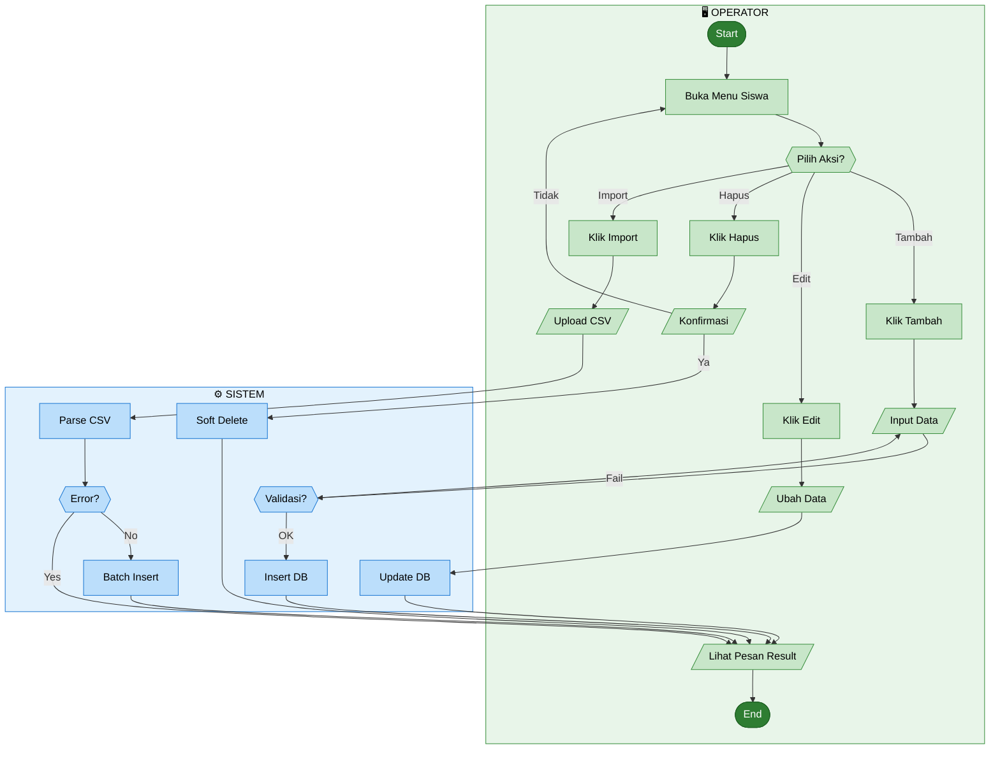

# Flowchart Kelola Siswa (Swimlane)

```mermaid
flowchart TD
    %% === SWIMLANE: OPERATOR ===
    subgraph OPERATOR["🖥️ OPERATOR"]
        direction TB
        START([Start])
        A["Buka Menu Siswa"]
        B{{"Pilih Aksi?"}}

        %% ADD
        C["Klik Tambah"]
        C1[/"Input Data"/]

        %% EDIT
        D["Klik Edit"]
        D1[/"Ubah Data"/]

        %% DELETE
        E["Klik Hapus"]
        E1[/"Konfirmasi"/]

        %% IMPORT
        F["Klik Import"]
        F1[/"Upload CSV"/]

        MSG[/"Lihat Pesan Result"/]
        END([End])
    end

    %% === SWIMLANE: SISTEM ===
    subgraph SISTEM["⚙️ SISTEM"]
        direction TB
        G{{"Validasi?"}}
        H["Insert DB"]
        I["Update DB"]
        J["Soft Delete"]
        K["Parse CSV"]
        L{{"Error?"}}
        M["Batch Insert"]
    end

    %% === FLOW ===
    START --> A
    A --> B

    %% Add Flow
    B -->|Tambah| C
    C --> C1
    C1 --> G
    G -->|OK| H
    H --> MSG
    G -->|Fail| C1

    %% Edit Flow
    B -->|Edit| D
    D --> D1
    D1 --> I
    I --> MSG

    %% Delete Flow
    B -->|Hapus| E
    E --> E1
    E1 -->|Ya| J
    J --> MSG
    E1 -->|Tidak| A

    %% Import Flow
    B -->|Import| F
    F --> F1
    F1 --> K
    K --> L
    L -->|No| M
    M --> MSG
    L -->|Yes| MSG

    MSG --> END

    %% === STYLING ===
    style START fill:#2E7D32,stroke:#1B5E20,color:#fff
    style END fill:#2E7D32,stroke:#1B5E20,color:#fff

    style OPERATOR fill:#E8F5E9,stroke:#388E3C,color:#000
    style SISTEM fill:#E3F2FD,stroke:#1976D2,color:#000

    %% Nodes Operator
    style A fill:#C8E6C9,stroke:#388E3C,color:#000
    style B fill:#C8E6C9,stroke:#388E3C,color:#000
    style C fill:#C8E6C9,stroke:#388E3C,color:#000
    style C1 fill:#C8E6C9,stroke:#388E3C,color:#000
    style D fill:#C8E6C9,stroke:#388E3C,color:#000
    style D1 fill:#C8E6C9,stroke:#388E3C,color:#000
    style E fill:#C8E6C9,stroke:#388E3C,color:#000
    style E1 fill:#C8E6C9,stroke:#388E3C,color:#000
    style F fill:#C8E6C9,stroke:#388E3C,color:#000
    style F1 fill:#C8E6C9,stroke:#388E3C,color:#000
    style MSG fill:#C8E6C9,stroke:#388E3C,color:#000

    %% Nodes Sistem
    style G fill:#BBDEFB,stroke:#1976D2,color:#000
    style H fill:#BBDEFB,stroke:#1976D2,color:#000
    style I fill:#BBDEFB,stroke:#1976D2,color:#000
    style J fill:#BBDEFB,stroke:#1976D2,color:#000
    style K fill:#BBDEFB,stroke:#1976D2,color:#000
    style L fill:#BBDEFB,stroke:#1976D2,color:#000
    style M fill:#BBDEFB,stroke:#1976D2,color:#000
```
