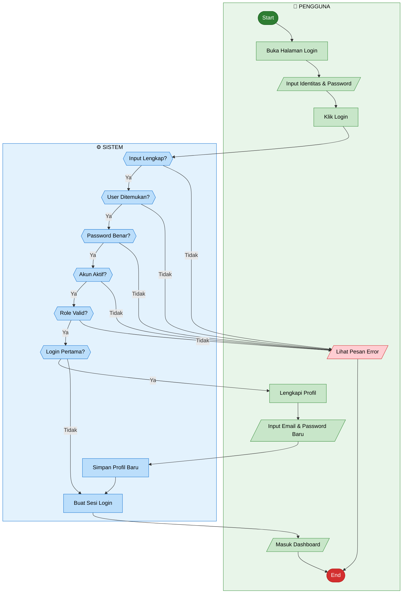

# Flowchart Login (Swimlane)

```mermaid
flowchart TD
    %% === SWIMLANE: PENGGUNA ===
    subgraph PENGGUNA["👤 PENGGUNA"]
        direction TB
        START([Start])
        A["Buka Halaman Login"]
        B[/"Input Identitas & Password"/]
        C["Klik Login"]

        %% Jarak Kosong agar sejajar dengan Sistem
        SPACE1[ ]:::hidden
        SPACE2[ ]:::hidden
        SPACE3[ ]:::hidden
        SPACE4[ ]:::hidden

        F["Lengkapi Profil"]
        G[/"Input Email & Password Baru"/]
        DASH[/"Masuk Dashboard"/]
        ERR_MSG[/"Lihat Pesan Error"/]
        END([End])
    end

    %% === SWIMLANE: SISTEM ===
    subgraph SISTEM["⚙️ SISTEM"]
        direction TB
        %% Spacer agar sejajar dengan Start-C
        S_START[ ]:::hidden
        S_A[ ]:::hidden
        S_B[ ]:::hidden

        D{{"Input Lengkap?"}}
        E{{"User Ditemukan?"}}
        H{{"Password Benar?"}}
        I{{"Akun Aktif?"}}
        J{{"Role Valid?"}}
        K{{"Login Pertama?"}}
        L["Buat Sesi Login"]
        M["Simpan Profil Baru"]
    end

    %% === ALIGNMENT (Invisible Links) ===
    START ~~~ S_START
    A ~~~ S_A
    B ~~~ S_B
    C ~~~ D

    %% === FLOW UTAMA ===
    START --> A --> B --> C
    C --> D

    %% Validasi Chain
    D -->|Ya| E
    E -->|Ya| H
    H -->|Ya| I
    I -->|Ya| J
    J -->|Ya| K

    %% Error Flow (Ke User)
    D -->|Tidak| ERR_MSG
    E -->|Tidak| ERR_MSG
    H -->|Tidak| ERR_MSG
    I -->|Tidak| ERR_MSG
    J -->|Tidak| ERR_MSG

    %% Login Pertama Flow
    K -->|Ya| F
    F --> G --> M --> L

    %% Login Normal Flow
    K -->|Tidak| L

    L --> DASH --> END
    ERR_MSG --> END

    %% === STYLING ===
    classDef hidden display:none;

    style START fill:#2E7D32,stroke:#1B5E20,color:#fff
    style END fill:#D32F2F,stroke:#B71C1C,color:#fff

    style PENGGUNA fill:#E8F5E9,stroke:#388E3C,color:#000
    style SISTEM fill:#E3F2FD,stroke:#1976D2,color:#000

    %% Nodes
    style A fill:#C8E6C9,stroke:#388E3C,color:#000
    style B fill:#C8E6C9,stroke:#388E3C,color:#000
    style C fill:#C8E6C9,stroke:#388E3C,color:#000
    style F fill:#C8E6C9,stroke:#388E3C,color:#000
    style G fill:#C8E6C9,stroke:#388E3C,color:#000
    style DASH fill:#C8E6C9,stroke:#388E3C,color:#000
    style ERR_MSG fill:#FFCDD2,stroke:#D32F2F,color:#000

    style D fill:#BBDEFB,stroke:#1976D2,color:#000
    style E fill:#BBDEFB,stroke:#1976D2,color:#000
    style H fill:#BBDEFB,stroke:#1976D2,color:#000
    style I fill:#BBDEFB,stroke:#1976D2,color:#000
    style J fill:#BBDEFB,stroke:#1976D2,color:#000
    style K fill:#BBDEFB,stroke:#1976D2,color:#000
    style L fill:#BBDEFB,stroke:#1976D2,color:#000
    style M fill:#BBDEFB,stroke:#1976D2,color:#000
```
