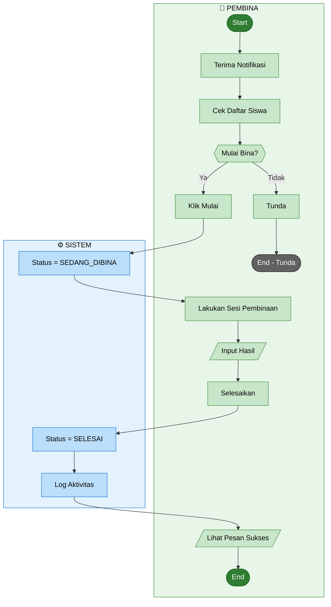

# Flowchart Pembinaan (Swimlane)

```mermaid
flowchart TD
    %% === SWIMLANE: PEMBINA ===
    subgraph PEMBINA["👤 PEMBINA"]
        direction TB
        START([Start])
        A["Terima Notifikasi"]
        B["Cek Daftar Siswa"]
        C{{"Mulai Bina?"}}
        D["Klik Mulai"]
        E["Lakukan Sesi Pembinaan"]
        F[/"Input Hasil"/]
        G["Selesaikan"]
        H["Tunda"]
        MSG[/"Lihat Pesan Sukses"/]
        END([End])
        END_WAIT([End - Tunda])
    end

    %% === SWIMLANE: SISTEM ===
    subgraph SISTEM["⚙️ SISTEM"]
        direction TB
        I["Status = SEDANG_DIBINA"]
        J["Status = SELESAI"]
        K["Log Aktivitas"]
    end

    %% === FLOW ===
    START --> A
    A --> B
    B --> C

    %% Branch Mulai
    C -->|Ya| D
    D --> I
    I --> E
    E --> F
    F --> G
    G --> J
    J --> K
    K --> MSG
    MSG --> END

    %% Branch Tunda
    C -->|Tidak| H
    H --> END_WAIT

    %% === STYLING ===
    style START fill:#2E7D32,stroke:#1B5E20,color:#fff
    style END fill:#2E7D32,stroke:#1B5E20,color:#fff
    style END_WAIT fill:#616161,stroke:#212121,color:#fff

    style PEMBINA fill:#E8F5E9,stroke:#388E3C,color:#000
    style SISTEM fill:#E3F2FD,stroke:#1976D2,color:#000

    %% Nodes Pembina
    style A fill:#C8E6C9,stroke:#388E3C,color:#000
    style B fill:#C8E6C9,stroke:#388E3C,color:#000
    style C fill:#C8E6C9,stroke:#388E3C,color:#000
    style D fill:#C8E6C9,stroke:#388E3C,color:#000
    style E fill:#C8E6C9,stroke:#388E3C,color:#000
    style F fill:#C8E6C9,stroke:#388E3C,color:#000
    style G fill:#C8E6C9,stroke:#388E3C,color:#000
    style H fill:#C8E6C9,stroke:#388E3C,color:#000
    style MSG fill:#C8E6C9,stroke:#388E3C,color:#000

    %% Nodes Sistem
    style I fill:#BBDEFB,stroke:#1976D2,color:#000
    style J fill:#BBDEFB,stroke:#1976D2,color:#000
    style K fill:#BBDEFB,stroke:#1976D2,color:#000
```
