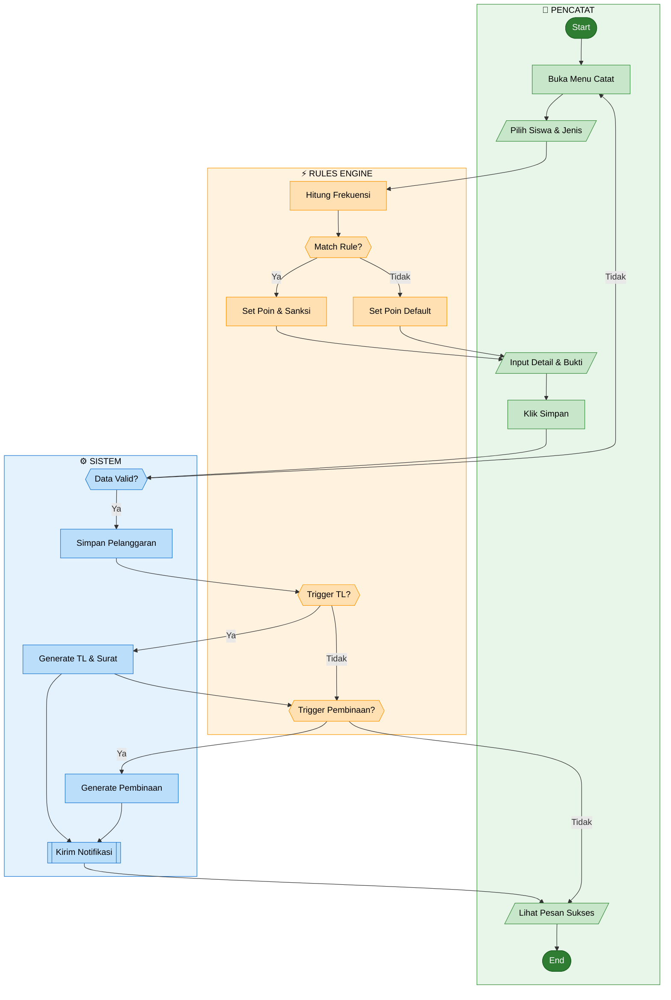

# Flowchart Pencatatan (Swimlane)

```mermaid
flowchart TD
    %% === SWIMLANE: PENCATAT ===
    subgraph PENCATAT["📝 PENCATAT"]
        direction TB
        START([Start])
        A["Buka Menu Catat"]
        B[/"Pilih Siswa & Jenis"/]
        C[/"Input Detail & Bukti"/]
        D["Klik Simpan"]
        MSG_SUKSES[/"Lihat Pesan Sukses"/]
        END([End])
    end

    %% === SWIMLANE: RULES ENGINE ===
    subgraph RULES["⚡ RULES ENGINE"]
        direction TB
        E["Hitung Frekuensi"]
        F{{"Match Rule?"}}
        G["Set Poin & Sanksi"]
        H["Set Poin Default"]
        K{{"Trigger TL?"}}
        L{{"Trigger Pembinaan?"}}
    end

    %% === SWIMLANE: SISTEM ===
    subgraph SISTEM["⚙️ SISTEM"]
        direction TB
        I{{"Data Valid?"}}
        J["Simpan Pelanggaran"]
        M["Generate TL & Surat"]
        N["Generate Pembinaan"]
        O[["Kirim Notifikasi"]]
    end

    %% === FLOW ===
    START --> A
    A --> B
    B --> E

    E --> F
    F -->|Ya| G
    F -->|Tidak| H

    G --> C
    H --> C

    C --> D
    D --> I

    I -->|Ya| J
    I -->|Tidak| A

    J --> K
    K -->|Ya| M
    K -->|Tidak| L
    M --> O

    M --> L
    L -->|Ya| N
    L -->|Tidak| MSG_SUKSES
    N --> O

    O --> MSG_SUKSES
    MSG_SUKSES --> END

    %% === STYLING ===
    style START fill:#2E7D32,stroke:#1B5E20,color:#fff
    style END fill:#2E7D32,stroke:#1B5E20,color:#fff

    style PENCATAT fill:#E8F5E9,stroke:#388E3C,color:#000
    style RULES fill:#FFF3E0,stroke:#FF9800,color:#000
    style SISTEM fill:#E3F2FD,stroke:#1976D2,color:#000

    %% Nodes Pencatat
    style A fill:#C8E6C9,stroke:#388E3C,color:#000
    style B fill:#C8E6C9,stroke:#388E3C,color:#000
    style C fill:#C8E6C9,stroke:#388E3C,color:#000
    style D fill:#C8E6C9,stroke:#388E3C,color:#000
    style MSG_SUKSES fill:#C8E6C9,stroke:#388E3C,color:#000

    %% Nodes Rules
    style E fill:#FFE0B2,stroke:#FF9800,color:#000
    style F fill:#FFE0B2,stroke:#FF9800,color:#000
    style G fill:#FFE0B2,stroke:#FF9800,color:#000
    style H fill:#FFE0B2,stroke:#FF9800,color:#000
    style K fill:#FFE0B2,stroke:#FF9800,color:#000
    style L fill:#FFE0B2,stroke:#FF9800,color:#000

    %% Nodes Sistem
    style I fill:#BBDEFB,stroke:#1976D2,color:#000
    style J fill:#BBDEFB,stroke:#1976D2,color:#000
    style M fill:#BBDEFB,stroke:#1976D2,color:#000
    style N fill:#BBDEFB,stroke:#1976D2,color:#000
    style O fill:#BBDEFB,stroke:#1976D2,color:#000
```
