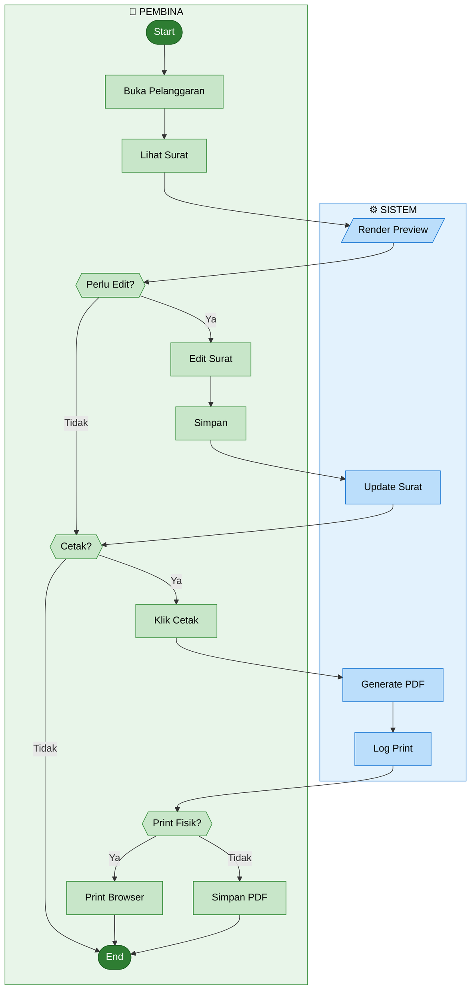

# Flowchart Surat Panggilan (Swimlane)

```mermaid
flowchart TD
    %% === SWIMLANE: PEMBINA ===
    subgraph PEMBINA["👤 PEMBINA"]
        direction TB
        START([Start])
        A["Buka Pelanggaran"]
        B["Lihat Surat"]
        C{{"Perlu Edit?"}}
        D["Edit Surat"]
        E["Simpan"]
        F{{"Cetak?"}}
        G["Klik Cetak"]
        H{{"Print Fisik?"}}
        I["Print Browser"]
        J["Simpan PDF"]
        END([End])
    end

    %% === SWIMLANE: SISTEM ===
    subgraph SISTEM["⚙️ SISTEM"]
        direction TB
        K[/"Render Preview"/]
        L["Update Surat"]
        M["Generate PDF"]
        N["Log Print"]
    end

    %% === FLOW ===
    START --> A
    A --> B
    B --> K
    K --> C

    %% Branch Edit
    C -->|Ya| D
    D --> E
    E --> L
    L --> F

    C -->|Tidak| F

    %% Branch Cetak
    F -->|Ya| G
    G --> M
    M --> N
    N --> H

    F -->|Tidak| END

    %% Branch Print Fisik
    H -->|Ya| I
    I --> END

    H -->|Tidak| J
    J --> END

    %% === STYLING ===
    style START fill:#2E7D32,stroke:#1B5E20,color:#fff
    style END fill:#2E7D32,stroke:#1B5E20,color:#fff

    style PEMBINA fill:#E8F5E9,stroke:#388E3C,color:#000
    style SISTEM fill:#E3F2FD,stroke:#1976D2,color:#000

    %% Nodes Pembina
    style A fill:#C8E6C9,stroke:#388E3C,color:#000
    style B fill:#C8E6C9,stroke:#388E3C,color:#000
    style C fill:#C8E6C9,stroke:#388E3C,color:#000
    style D fill:#C8E6C9,stroke:#388E3C,color:#000
    style E fill:#C8E6C9,stroke:#388E3C,color:#000
    style F fill:#C8E6C9,stroke:#388E3C,color:#000
    style G fill:#C8E6C9,stroke:#388E3C,color:#000
    style H fill:#C8E6C9,stroke:#388E3C,color:#000
    style I fill:#C8E6C9,stroke:#388E3C,color:#000
    style J fill:#C8E6C9,stroke:#388E3C,color:#000

    %% Nodes Sistem
    style K fill:#BBDEFB,stroke:#1976D2,color:#000
    style L fill:#BBDEFB,stroke:#1976D2,color:#000
    style M fill:#BBDEFB,stroke:#1976D2,color:#000
    style N fill:#BBDEFB,stroke:#1976D2,color:#000
```
